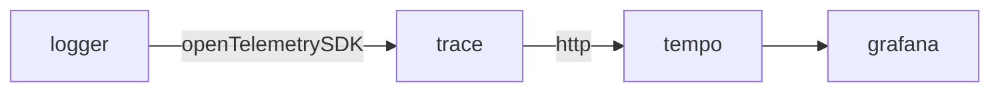

# logger

#### logger

对[opentelemetry-go](https://github.com/open-telemetry/opentelemetry-go)进行封装，降低`opentelemetry-go`的使用门槛。

#### 架构



#### Install

```text
go get -u -v gitee.com/Himan000/otel_zap_logger
```

#### 使用

可以参考[otel_zero](https://github.com/Himan000/otel_zero.git)的使用方法

#### License

Use of logger is governed by the Mit License
